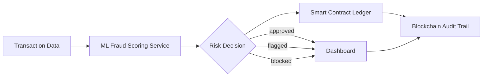

# 🚀 Blockchain-Enhanced Explainable AI for Real-Time Credit Card Fraud Detection

<p align="center">
  
  
  
  
  
  
</p>

<p align="center">
  A full-stack fraud detection platform that combines <strong>machine learning</strong>, <strong>blockchain auditability</strong>, and a polished <strong>real-time dashboard</strong> to detect, explain, and record suspicious card activity.
</p>

---

## ✨ What This Project Does

This repository demonstrates a practical fraud detection workflow built around three layers working together:

1. **ML decision engine**: scores a transaction with a trained Python model and produces a risk-based decision.
2. **Blockchain ledger**: stores transaction outcomes on-chain for tamper-resistant audit trails.
3. **Web dashboard**: gives operators a human-friendly interface for live monitoring, insights, and transaction review.

In other words, the platform is designed to answer three questions at once:

- Is this transaction suspicious?
- Why did the system make that decision?
- Can we prove the history of that decision later?

---

## 🧠 Why This Architecture Matters

Fraud systems usually struggle with one of two problems: they are either accurate but opaque, or explainable but easy to tamper with. This project tries to balance both:

- **Explainability** through ML-driven scoring and visible decision logic.
- **Integrity** through blockchain-backed transaction logging.
- **Operational visibility** through a modern dashboard and live data views.

That makes it useful as a demo, a research prototype, or a foundation for a larger production system.

---

## 🧩 Core Features

- **Real-time fraud risk scoring** using a Python inference service.
- **On-chain transaction registry** for immutable storage of transaction hashes and status metadata.
- **Batch transaction support** in the smart contract for more gas-efficient writes.
- **Interactive dashboard** built with Vite, React, and TypeScript.
- **Wallet-friendly workflow** with MetaMask and local blockchain support.
- **Model training pipeline** based on the Kaggle credit card dataset.
- **Structured deployment metadata** via `deployment-info.json` and `src/config/deployment-info.json`.
- **Reusable deployment scripts** for Hardhat and Ganache-style workflows.

---

## 🏗️ System Overview



### Main building blocks

- **Smart contract**: `contracts/TransactionRegistry.sol`
- **Frontend**: `src/` and `public/`
- **ML training and inference**: `ml/scripts/train_model.py` and `ml/scripts/serve_model.py`
- **Deployment helpers**: `scripts/` and `deploy-direct.mjs`

---

## 📁 Project Structure

```text
blockchain-realtime-fraud/
├── contracts/              # Solidity contract(s)
├── ml/                     # Training data, model code, artifacts, and services
├── public/                 # Static browser-side helpers
├── scripts/                # Deployment and environment utilities
├── src/                    # React frontend application
├── hardhat.config.cjs      # Hardhat configuration
├── vite.config.ts          # Vite configuration
├── deployment-info.json    # Root deployment metadata
└── README.md               # Project guide
```

### Notable frontend areas

- `src/components/fraud/` contains fraud-focused UI modules such as transaction feeds, analytics, maps, explainability views, and dashboards.
- `src/utils/` contains blockchain, analytics, fraud API, and transaction helpers.
- `src/contexts/` and `src/hooks/` support app-wide state and UI behavior.

---

## ⚡ Quick Start

### Prerequisites

- **Node.js** 16 or newer
- **npm** or a compatible package manager
- **Python** 3.9 or newer
- **MetaMask** browser extension
- A local Ethereum-compatible network such as **Hardhat Network** or **Ganache**

### Install dependencies

```bash
npm install
```

### Start a local blockchain

```bash
npx hardhat node
```

### Deploy the contract locally

```bash
npx hardhat run scripts/deploy.js --network localhost
```

### Run the frontend

```bash
npm run dev
```

### Connect MetaMask

- Add the local RPC endpoint: `http://127.0.0.1:8545`
- Use chain ID `31337` for Hardhat local development
- Import one of the test accounts printed by the node if you want to simulate transactions

---

## 🧪 Available Scripts

From `package.json`:

| Script | Purpose |
| --- | --- |
| `npm run dev` | Start the Vite development server |
| `npm run build` | Build the frontend for production |
| `npm run build:dev` | Build using the development Vite mode |
| `npm run lint` | Run ESLint across the workspace |
| `npm run preview` | Preview the production build locally |

---

## 🤖 Machine Learning Pipeline

The ML stack lives under `ml/` and is centered around the Kaggle credit card fraud dataset stored at `ml/data/raw/creditcard.csv`.

### Training flow

1. Load and validate the dataset.
2. Clean the data and keep the numeric fraud-detection features.
3. Train a logistic-regression pipeline with imputation and scaling.
4. Find the best decision threshold from the precision-recall curve.
5. Save the trained model and metadata in `ml/artifacts/`.

### Train locally

```bash
python -m venv .venv
.venv\\Scripts\\activate
pip install -r ml/requirements.txt
python ml/scripts/train_model.py
```

### Run the inference service

```bash
python ml/scripts/serve_model.py
```

### API endpoints

- `GET /health` returns model health and configuration details.
- `POST /analyze` scores a payload of transaction features and returns a fraud decision.

### Example request

```json
{
  "features": {
    "V1": -1.23,
    "V2": 0.44,
    "Amount": 2500,
    "Time": 13890
  }
}
```

The service transforms `Amount` consistently with training, scores the row, and returns an `approved`, `flagged`, or `blocked` decision.

---

## 📜 Smart Contract

The on-chain registry is implemented in `contracts/TransactionRegistry.sol`.

### Stored data

Each transaction record includes:

- transaction hash
- amount
- status code
- timestamp
- submitting address

### Public functions

- `storeTransaction(string txHash, uint256 amount, uint8 status)`
- `storeBatchTransactions(string[] txHashes, uint256[] amounts, uint8[] statuses)`
- `getTransaction(string txHash)`
- `getTransactionCount()`
- `getTransactionHashByIndex(uint256 index)`

### Status values

- `0` = Pending
- `1` = Approved
- `2` = Flagged
- `3` = Blocked

### Important behavior

- Duplicate transaction hashes are ignored.
- The contract emits `TransactionStored` whenever a new record is written.
- Batch writes are supported for more efficient updates.

---

## 🔧 Deployment Notes

The repository includes multiple deployment helpers, which suggests it has been used across different local and scripted flows.

- `scripts/deploy.js`
- `scripts/deploy.cjs`
- `scripts/deploy-new.js`
- `scripts/deploy-final.js`
- `deploy-direct.mjs`

Deployment metadata may appear in:

- `deployment-info.json`
- `src/config/deployment-info.json`

If you redeploy the contract, make sure the frontend is pointed at the latest address before testing the UI.

---

## 🧪 Validation Checklist

Before pushing changes or demoing the project, run:

```bash
npx hardhat compile
npm run lint
npm run build
```

If you update the ML stack as well, also run:

```bash
python ml/scripts/train_model.py
```

---

## 🛠️ Troubleshooting

- **MetaMask cannot connect**: confirm the local chain is running and the RPC URL is correct.
- **Contract address not found**: check the latest value in `deployment-info.json` and `src/config/deployment-info.json`.
- **Frontend fails to build**: run `npm install` again and verify your Node.js version.
- **ML service fails on startup**: ensure `ml/artifacts/fraud_model.joblib` exists and the model has already been trained.
- **Git push errors**: retry once after a short delay; if GitHub returns a 500 again, it is often a transient remote-side issue.

---

## 🤝 Contributing

1. Fork the repository.
2. Create a feature branch.
3. Make focused commits.
4. Run the validation commands above.
5. Open a pull request.

Please avoid checking large generated files into the repository unless they are intentionally part of the project artifact set.

---

## 📄 License

This project is licensed under the MIT License.

---

## ✉️ Contact

If you want to extend the dashboard, add a stronger explainability layer, or adapt the workflow for another fraud dataset, open an issue or build on top of the current architecture.
